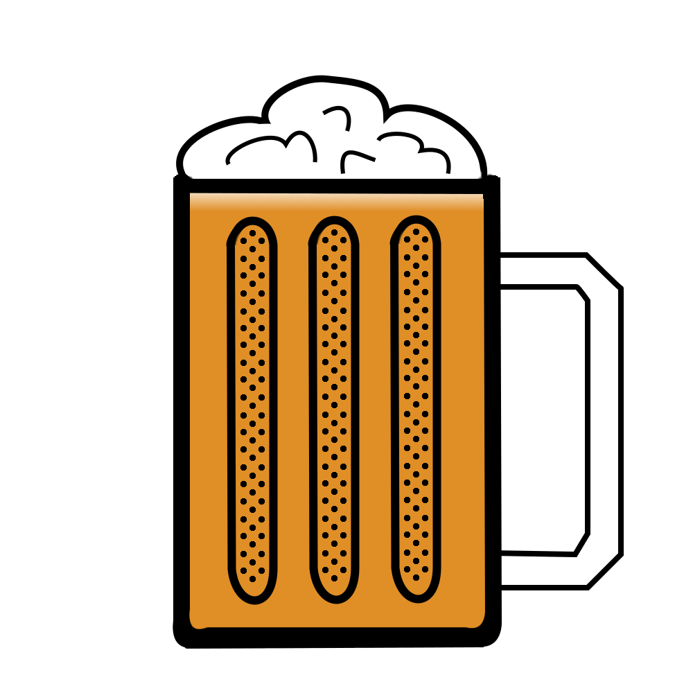

# Team B.E.E.R (11) Web Components


[](https://travis-ci.com/ucsd-cse112/Team11)
[](https://codeclimate.com/github/codeclimate/codeclimate/maintainability)
[](https://codeclimate.com/github/codeclimate/codeclimate/test_coverage)

<!-- TODO - Don't need if closed source -->


<!-- TODO - Change the link when Esther migrates page to Team 11 repo -->
<a href="https://zhaoesther.github.io/cse112-team11-website/"></a>

Our goal for this project is to create an extensible library of vanilla and lit-element web-components. Click on our logo above to head over to our team page. 

## Getting Started

### NPM

These instructions will get you a copy of the project up and running on your local machine for development and testing purposes. 

```
npm install [INSERT NAME OF TEAM 11 PACKAGE]
```

<!-- TODO - Git instructions? -->

### Prerequisites

<!-- TODO - Put testcafe and stuff like that -->

```
Give examples
```

### Installing

<!-- NPM takes care of these stuff so not sure what to put here, maybe unnecessary -->

A step by step series of examples that tell you how to get a development env running

Say what the step will be

```
Give the example
```

And repeat

```
until finished
```

End with an example of getting some data out of the system or using it for a little demo

## Running the tests

To run tests on the raw components
```
npm run raw-test
```

To run tests on the LitElement components
```
npm run port-test
```

To generate the docs
```
npm run docs:build
```
### Break down into end to end tests
<!-- TODO - Ask the testers for details on this -->
Explain what these tests test and why

```
Give an example
```

### And coding style tests

For details on our coding style guidelines, check out `.eslintrc.json`. 

For enforcing our coding style guidelines, we use ESLint.

```
npm run lint
```

## Built With

<!-- TODO - Not sure what to put here. Maybe VSCode and stuff like that or is it just CSS, JQuery, LitElements? -->

* [Lit Elements](https://lit-element.polymer-project.org/) - A simple base class used to build `beer-button-lit` and `beer-notification-lit`
* [NPM](https://www.npmjs.com/) - package manager used
* [ESLint](https://eslint.org/) - Linting utility used

## Contributing

<!-- TODO - Don't know if we need this but the gist of this is so that if we decide to go opensource and people want to contribute, these will be how contributions are organized.  -->

Please read [CONTRIBUTING.md](CONTRIBUTING.md) for details on our code of conduct, and the process for submitting pull requests to us.

## Versioning

<!-- TODO - Adopt a versioning guideline on meeting -->

TEMPORARY - We use [SemVer](http://semver.org/) for versioning. For the versions available, see the [tags on this repository](https://github.com/your/project/tags). 

## Team Members

<!-- TODO - We should probably change the roles up because we only stuck with it on Sprint 0 -->

| Team Roles        | Name             |
|:------------------|:-----------------|
| Team Lead         | Ricardo Molina   |
| Co-Lead           | Richard Pena     |
| Coder             | Simon Giraud     |
| Coder             | Donghak Alex Oh  |
| Coder             | Phillip Jo       |
| DevOps            | Gordon Hu        |
| DevOps            | Eric Khoi Huynh  |
| Tools & Utility   | Tenshi Mori      |
| Tools & Utility   | Kyle Burt        |
| Quality Assurance | Esther Zhao      |
| Quality Assurance | Austin Moss-Ennis|

## License

<!-- TODO - Don't need if closed source -->

This project is licensed under the MIT License - see the [LICENSE.md](LICENSE.md) file for details

## Acknowledgments

<!-- TODO - Decide what we want to put here. Looks like other teams are putting SauceLabs or BrowserStack if they got some free stuff but otherwise, I don't see anything -->
